### Contents

- Topics, Partitions, and Offsets
- Producers and Message Keys
- Consumers & Deserialization
- Consumer Groups & Consumer Offsets
- Brokers and Topics
- Topic Replication
- Producer Acknowledgments & Topic Durability
- Zookeeper
- Kafka KRaft - Removing Zookeeper
- Theory Roundup

---

### Topics, Partitions, and Offsets

**Topics**: a particular stream of data

- Like a table in a database (without all the constraints)
- You can have as many topics as you want
- A topic is identified by its name
- Any kind of message format
- The sequence of messages is called a data stream
- You can’t query topics, instead, use Kafka Producers to send data and Kafka Consumers to read the data

Topics are split into **Partitions** (for example: 100 partitions)

- Messages within each partition are ordered
- Each message within a partition gets an incremental ID, called an **offset**
- Kafka topics are **immutable**: once data is written to a partition, it can’t be changed

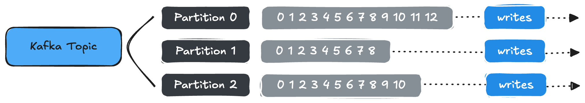

**Topic example**: `truck_gps`

- Say you have a fleet of trucks; each truck reports its GPS position to Kafka.
- Each truck will send a message to Kafka every 20 seconds containing:
    - the truck ID
    - the truck position (latitude and longitude)
- You can have a topic `truck_gps` that contains the position of all trucks.
- We choose to create that topic with 10 partitions (arbitrary number)

**Important notes**

- Once the data is written to a partition, it can’t be changed (immutability)
- Data is kept only for a limited time (default is one week - configurable)
- Offset only has a meaning for a specific partition.
    - e.g., offset 3 in partition 0 doesn’t represent the same data as offset 3 in partition 1
    - Offsets are not re-used even if previous messages have been deleted
- Order is guaranteed only within a partition (not across partitions)
- Data is assigned randomly to a partition unless a key is provided
- You can have as many partitions per topic as you want

### Producers and Message Keys

**Producers**

- Producers write data to topics (which are made of partitions)
- Producers know to which partition to write to (and which Kafka broker has it)
- In case of Kafka broker failures, Producers will automatically recover

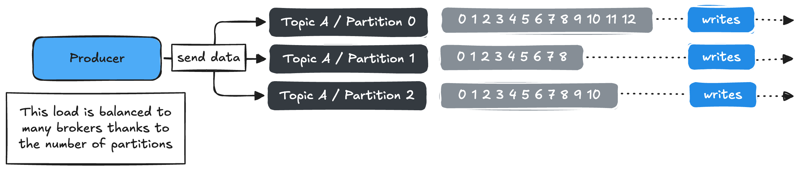

**Producers: Message Keys**

- Producers can choose to send a **key** with the message (string, number, binary, etc…)
    
    ```
    if key is null:
    	data is sent round robin (partition 0, then 1, then 2, ...)
    if key is not null:
    	all messages for that key will always go to the same partition (hashing)
    ```
    
- A key is typically sent if you need message ordering for a specific field (ex: `truck_id`)

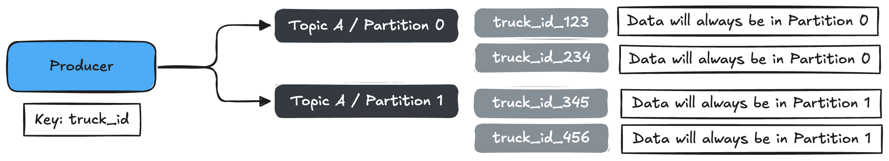

**Kafka Messages Anatomy**

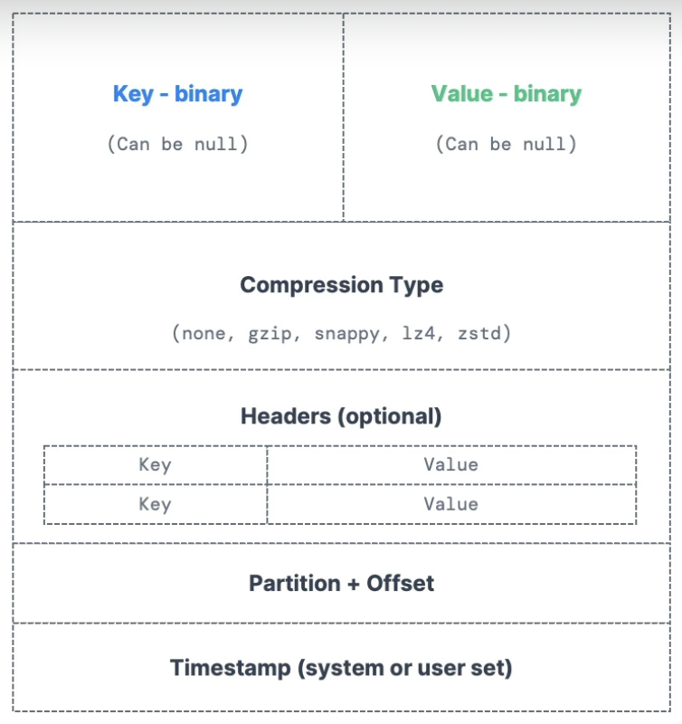

**Kafka Message Serializer**

- Kafka only accepts bytes as an input from producers and sends bytes out as an output to consumers
- Message Serialization means transforming objects/data into bytes
- They are used on the value and the key
- Common Serializers
    - String (including JSON)
    - Int, Float
    - Avro
    - Protobuf

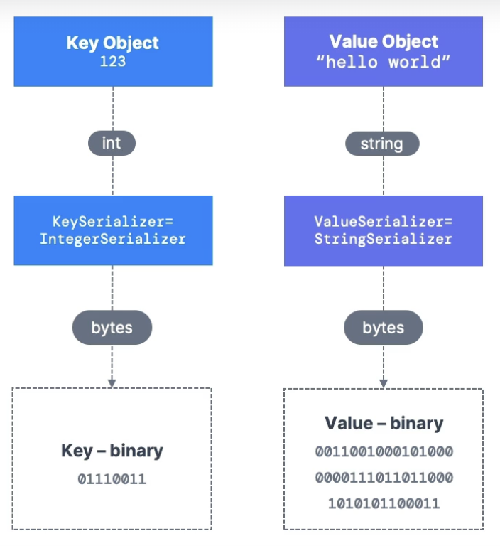

**(For the Curious) Kafka Message Key Hashing**

- A Kafka partitioner is a code logic that takes a record and determines to which partition to send it into.
    
    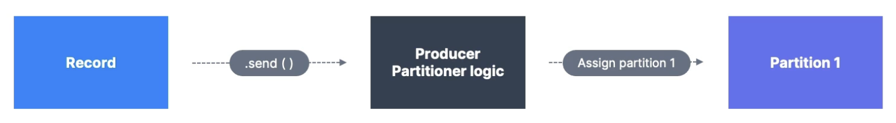
    
- **Key Hashing** is the process of determining the mapping of a key to a partition
- In the default Kafka partitioner, the keys are hashed using the **murmur2 algorithm**, with the formula below:
    
    ```
    targetPartition = Math.abs(Utils.murmur2(keyBytes)) % (numPartitions - 1)
    ```
    

### **Consumers & Deserialization**

**Consumers**

- Consumers read data from a topic (identified by name) - “pull model”
- Consumers automatically know which broker to read from
- In case of broker failures, consumers know how to recover
- Data is read in order from low to high offset **within each partitions**
    
    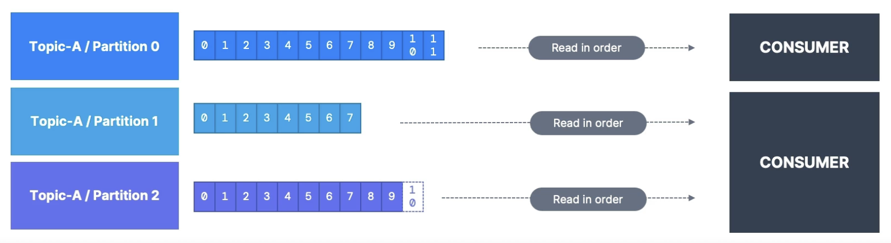
    

**Consumer Deserializer**

- Deserialize indicates how to transform bytes into objects/data
- They are used on the key and the value of the message
- Common Deserializers
    - String (including JSON)
    - Int, Float
    - Avro
    - Protobuf
- The Serialization/Deserialization type must not change during a topic lifecycle (create a new topic instead)
    
    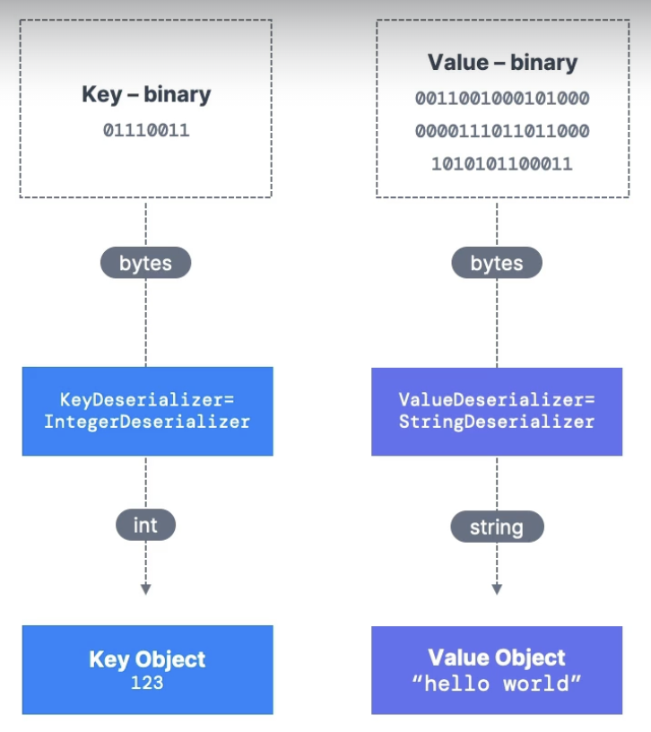
    

### Consumer Groups & Consumer Offsets

**Consumer Groups**

- All the consumers in an application read data as a consumer group
- Each consumer within a group read from exclusive partitions
    
    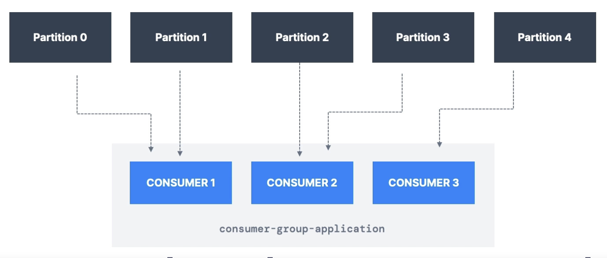
    

**What if Too Many Consumers?**

- If you have more consumers than partitions, some consumers will be inactive
    
    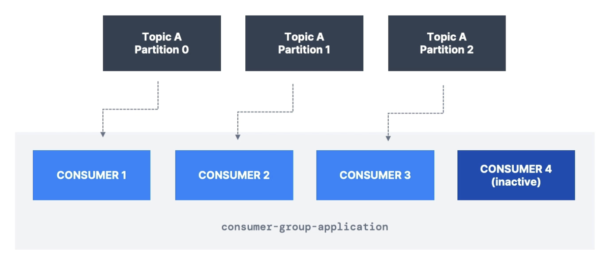
    

**Multiple Consumers on One Topic**

- In Apache Kafka, it is acceptable to have multiple consumer groups on the same topic
- To create distinct consumer groups, use the consumer property `group.id`
    
    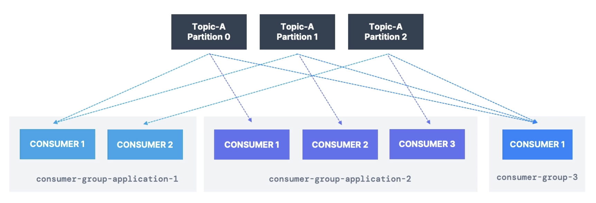
    

**Consumer Offsets**

- Kafka stores the offsets at which a consumer group has been reading
- The offsets committed are in Kafka topic named `__consumer_offsets`
- When a consumer in a group has processed data received from Kafka, it should be periodically committing the offsets
    - the Kafka broker will write to `__consumer_offsets`, not the group itself
- If a consumer dies, it will be able to read back from where it left off thanks to the committed consumer offsets!
    
    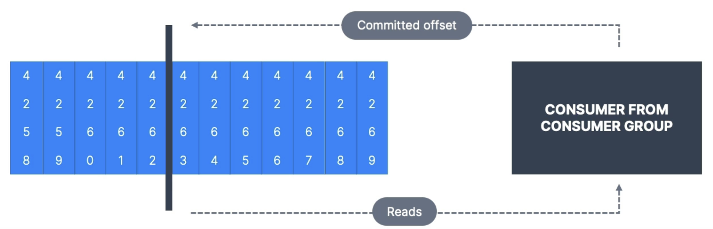
    

**Delivery Semantics for Consumers**

- By default, Java Consumers will automatically commit offsets (at least once)
- There are 3 delivery semantics if you choose to commit manually
    - **1) At Least Once (usually preferred)**
        - Offsets are committed after the message is processed
        - If the processing goes wrong, the message will be read again
        - This can result in duplicate processing of messages. Make sure your processing is idempotent
            - i.e., Processing again the messages won’t impact your systems.
    - **2) At Most Once**
        - Offsets are committed as soon as messages are received
        - If the processing goes wrong, some messages will be lost
            - They won’t be read again
    - **3) Exactly Once**
        - For Kafka → Kafka workflows: use the Transactional API (easy with Kafka Streams API)
        - For Kafka → External System workflows: use an idempotent consumer

### Brokers and Topics

**Kafka Brokers**

- A Kafka cluster is composed of multiple brokers(=servers)
- Each broker is identified with its ID (integer)
- Each broker contains certain topic partitions
- After connecting to any broker (called a bootstrap broker), you will be connected to the entire cluster
    - Kafka clients have smart mechanics for that
- A good number to get started is 3 brokers, but some big clusters have over 100 brokers
- In these examples, we choose to number brokers starting at 100 (arbitrary)
    
    
    

**Brokers and Topics**

- Example of Topic A with 3 partitions and Topic B with 3 partitions
- Note: data is distributed, and Broker 103 doesn’t have any Topic B data
    
    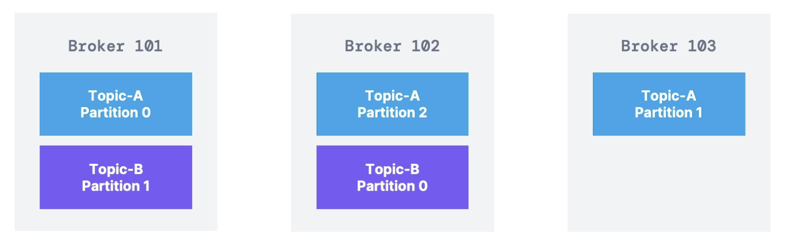
    

**Kafka Broker Discovery**

- Every Kafka broker is also called a “bootstrap server”
- That means that **you only need to connect to one broker**, and the Kafka clients will know how to be connected to the entire cluster (smart clients)
- Each broker knows about all brokers, topics, and partitions (metadata)
    
    
    

### Topic Replication

**Topic Replication Factor**

- Topics should have a replication factor > 1 (usually between 2 and 3)
- This way if a broker is down, another broker can serve the data
- Example
    - Topic A: 2 partitions
    - Replication Factor = 2
    
    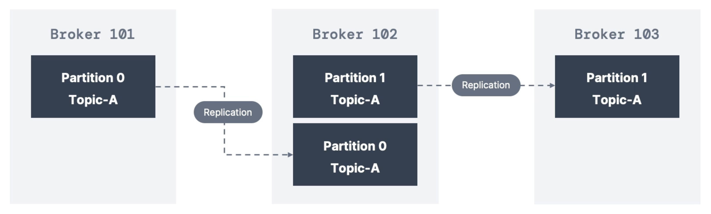
    
- Example
    - We lost Broker 102
    - Result: Broker 101 and 103 can still serve the data
    
    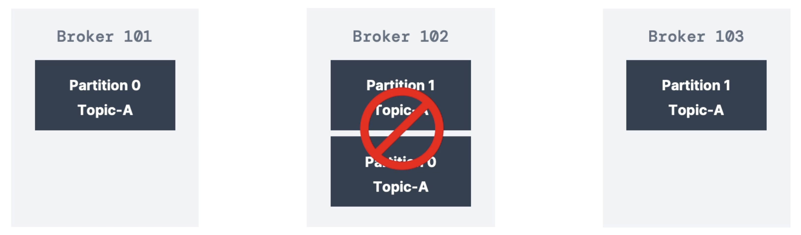
    

**Concept of Leader for a Partition**

- At any time, only ONE broker can be a leader for a given partition
- Producers can only send data to the broker that is leader of a partition
- The other brokers will replicate the data
- Therefore, each partition has one leader and multiple ISR (in-sync replica)
    
    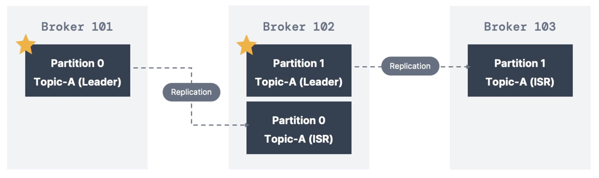
    

**Default Producer & Consumer Behavior with Leaders**

- Kafka Producers can only write to the leader broker for a partition
- Kafka Consumers by default will read from the leader broker for a partition
    
    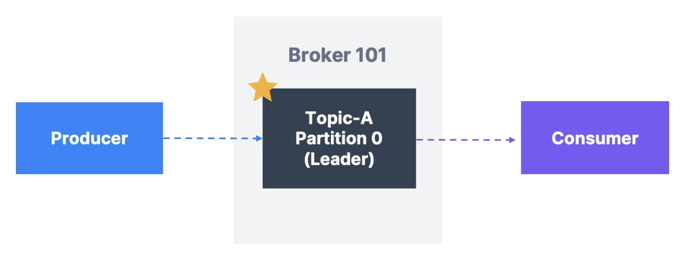
    

**Kafka Consumers Replica Fetching (Kafka v2.4+)**

- Since Kafka 2.4, it is possible to configure consumers to read from the closest replica
- This may help improve latency, and also decrease network costs if using the cloud
    
    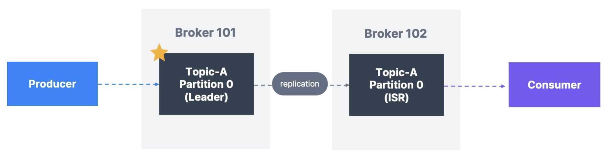
    

### **Producer Acknowledgments & Topic Durability**

**Producer Acknowledgements (acks)**

- Producers can choose to receive acknowledgment of data writes:
    - `acks=0`: Producer won’t wait for acknowledgment (possible data loss)
    - `acks=1`: Producer will wait for leader acknowledgment (limited data loss)
    - `acks=all`: Leader + replicas acknowledgment (no data loss)

**Kafka Topic Durability**

- For a topic replication factor of 3, topic data durability can withstand 2 brokers loss.
- As a rule, for a replication factor of N, you can permanently lose up to N-1 brokers and still recover your data.

### Zookeeper

**Zookeeper**

- Zookeeper manages brokers (keeps a list of them)
- Zookeeper helps in performing leader election for partitions
- Zookeeper sends notifications to Kafka in case of changes
    - e.g., new topic, broker dies, broker comes up, delete topics, etc…
- **Kafka 2.x: can’t work without Zookeeper**
- **Kafka 3.x: can work without Zookeeper (KIP-500) - using Kafka Raft instead**
- **Kafka 4.x: will not have Zookeeper**
- Zookeeper by design operates with an odd number of servers (1, 3, 5, 7)
- Zookeeper has a leader (writes), and the rest of the servers are followers (reads)
- Zookeeper does NOT store consumer offsets with Kafka > v0.10

**Zookeeper Cluster (ensemble)**

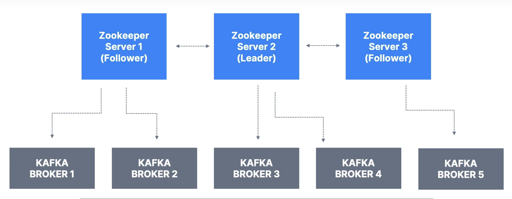

**Should You Use Zookeeper?**

- **With Kafka Brokers?**
    - Yes, until Kafka 4.0 is out while waiting for Kafka without Zookeeper to be production-ready
- **With Kafka Clients?**
    - Over time, the Kafka clients and CLI have migrated to leverage the brokers as a connection endpoint instead of Zookeeper.
    - Since Kafka 0.10, consumers store offset in Kafka and Zookeeper and must not connect to Zookeeper as it is deprecated.
    - Since Kafka 2.2, the `kafka-topics.sh` CLI command references Kafka brokers and not Zookeeper for topic management (creation, deletion, etc…) and the Zookeeper CLI argument is deprecated.
    - All the APIs and commands that were previously leveraging Zookeeper are migrated to use Kafka instead, so that when clusters are migrated to be without Zookeeper, the change is invisible to clients.
    - Zookeeper is also less secure than Kafka, and therefore Zookeeper ports should only be opened to allow traffic from Kafka brokers, and not Kafka clients.
    - **Therefore, to be a great modern-day Kafka developer, never ever use Zookeeper as a configuration in your Kafka clients, and other programs that connect to Kafka.**

### Kafka KRaft - Removing Zookeeper

**About Kafka KRaft**

- In 2020, the Apache Kafka project started to work **to remove the Zookeeper dependency** from it. (KIP-500)
- Zookeeper shows scaling issues when Kafka clusters have 100,000+ partitions.
- By removing Zookeeper, Apache Kafka can:
    - Scale to millions of partitions, and becomes easier to maintain and set-up
    - Improve stability, makes it easier to monitor, support and administer
    - Single security model for the whole system
    - Single process to start with Kafka
    - Faster controller shutdown and recovery time
- Kafka 3.x now implements the Raft protocol (KRaft) to replace Zookeeper
    - Production-ready since Kafka 3.3.1 (KIP-833)
    - Kafka 4.0 will be released only with KRaft (no Zookeeper)

### Theory Roundup

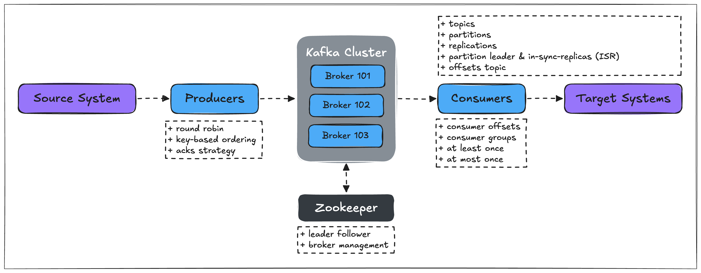