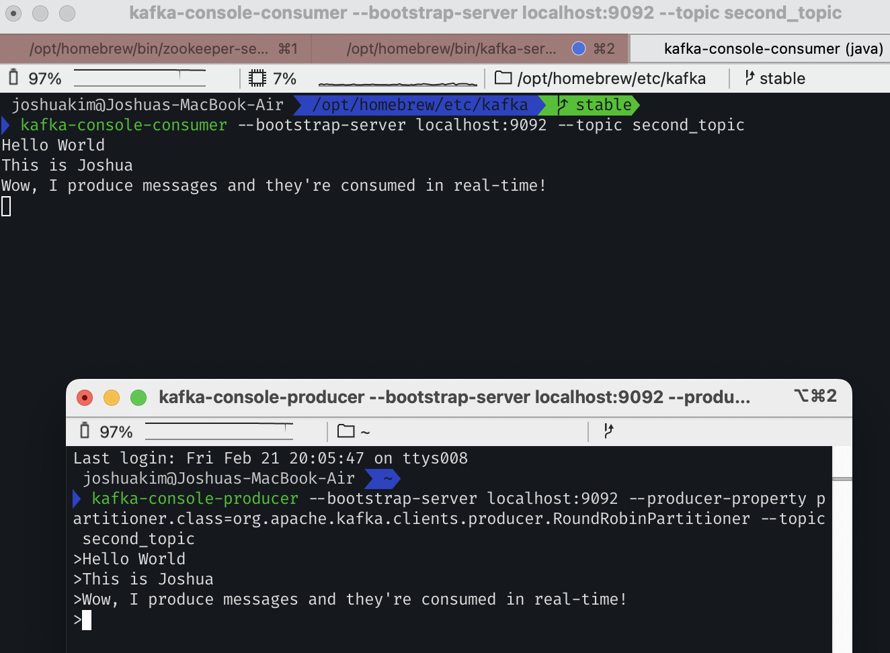
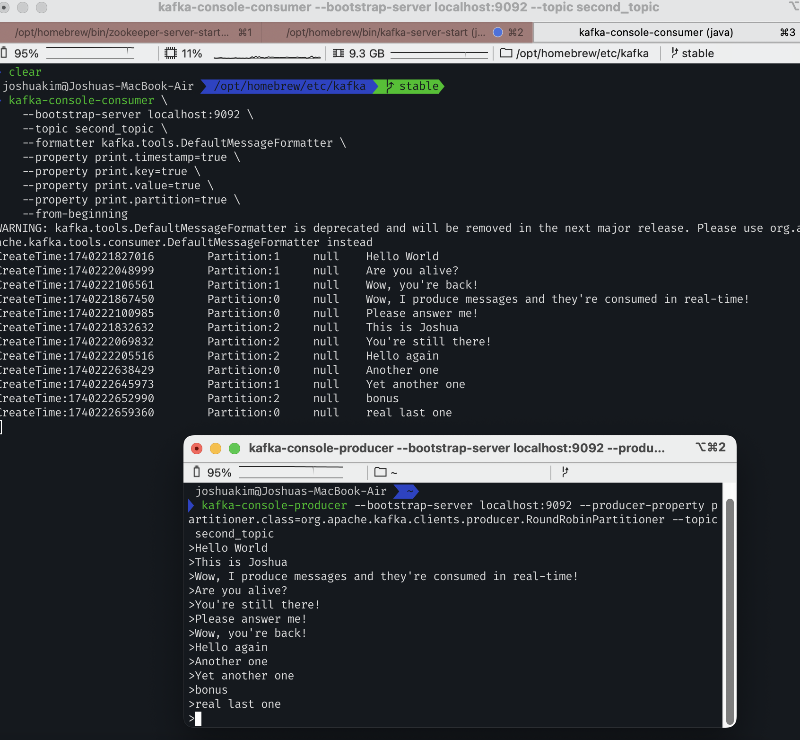

# Contents

1. Intro to CLI
2. Kafka Topics CLI
3. Kafka Console Producer CLI
4. Kafka Console Consumer CLI

---

# Intro to CLI

- They come bundled with the Kafka binaries.
- You should be able to invoke the CLI from anywhere on your computer.

```bash
kafka-topics
```

- Use the `--bootstrap-server` option everywhere, not `--zookeeper`.

```bash
# Yes!
kafka-topics --bootstrap-server localhost:9092
# No!
kafka-topics --zookeeper localhost:2181
```

# Kafka Topics CLI

### 1. Create Kafka Topics

- There's no topics at the moment.

```bash
kafka-topics --bootstrap-server localhost:9092 --list
```

- Let's create the first topic.

```bash
kafka-topics --bootstrap-server localhost:9092 --topic first_topic --create
```

- Let's create the second topic.
    - partitions: 3

```bash
kafka-topics --bootstrap-server localhost:9092 --topic second_topic --create --partitions 3
```

- Let's create the third topic.
    - partitions: 3
    - replication factor: 2 -> 1

```bash
# This results in error because there's only 1 broker in my localhost.
    # ================
    # InvalidReplicationFactorException: Replication factor: 2 larger than available brokers: 1.
    # ================
kafka-topics --bootstrap-server localhost:9092 --topic third_topic --create --partitions 3 --replication-factor 2
# Try this out instead!
kafka-topics --bootstrap-server localhost:9092 --topic third_topic --create --partitions 3 --replication-factor 1
```

### 2. List Kafka Topics

```bash
kafka-topics --bootstrap-server localhost:9092 --list
```

### 3. Describe Kafka Topics

```bash
kafka-topics --bootstrap-server localhost:9092 --topic first_topic --describe
kafka-topics --bootstrap-server localhost:9092 --topic second_topic --describe
kafka-topics --bootstrap-server localhost:9092 --topic third_topic --describe
```

### 4. Delete a Kafka Topic

- It only works if `delete.topic.enable=true`.

```bash
kafka-topics --bootstrap-server localhost:9092 --topic first_topic --delete
```

# Kafka Console Producer CLI

### Create `first_topic`.

```bash
kafka-topics --bootstrap-server localhost:9092 --topic first_topic --create --partitions 1
```

### Producing

- Producing

```bash
kafka-console-producer --bootstrap-server localhost:9092 --topic first_topic

> Hello World
> My name is Joshua
> I love Kafka
> ^C (to exit the producer)
```

- Consuming (check if the messages are successfully sent.)

```bash
kafka-console-consumer --bootstrap-server localhost:9092 --topic first_topic --from-beginning
```

### Producing with Properties

- Producing

```bash
kafka-console-producer --bootstrap-server localhost:9092 --topic first_topic --producer-property acks=all

> Message is acked
> Just for fun
> Learning!
```

- Consuming

```bash
kafka-console-consumer --bootstrap-server localhost:9092 --topic first_topic --from-beginning
```

### Producing to a non-existing topic

- Producing

```bash
kafka-console-producer --bootstrap-server localhost:9092 --topic new_topic

> Hello World
```

- When you produce like above, you'll get an error like below:

```plain
WARN [Producer clientId=console-producer] The metadata response from the cluster reported a recoverable issue with correlation id 5 : {new_topic=LEADER_NOT_AVAILABLE} (org.apache.kafka.clients.NetworkClient)
```

- However, the `new_topic` has been created.

```bash
kafka-topics --bootstrap-server localhost:9092 --list
kafka-topics --bootstrap-server localhost:9092 --topic new_topic --describe
kafka-console-consumer --bootstrap-server localhost:9092 --topic new_topic --from-beginning
```

- In case you would like to change the default number of partitions, change the value of `num.partitions=3`.

```bash
cd /opt/homebrew/etc/kafka
vi server.properties

# The default number of log partitions per topic. More partitions allow greater
# parallelism for consumption, but this will also result in more files across
# the brokers.
num.partitions=3
```

- Producing again

```bash
kafka-console-producer --bootstrap-server localhost:9092 --topic new_topic_2

> Hello World
```

- However, the `new_topic_2` has been created with **3 partitions**.

```bash
kafka-topics --bootstrap-server localhost:9092 --topic new_topic_2 --describe
```

### Important Note: Please create topics with the appropriate number of partitions before producing to them!

### Producing with Keys

- Producing

```bash
kafka-console-producer --bootstrap-server localhost:9092 --topic first_topic --property parse.key=true --property key.separator=:

> example key:example value
> name:Joshua
> name:Amber
```

- Consuming

```bash
kafka-console-consumer --bootstrap-server localhost:9092 --topic first_topic --from-beginning
```

# Kafka Console Consumer CLI

### Create a topic with 3 partitions

```bash
kafka-topics --bootstrap-server localhost:9092 --topic second_topic --create --partitions 3
```

### Consuming

- on a terminal:

```bash
kafka-console-consumer --bootstrap-server localhost:9092 --topic second_topic
```

- on another terminal:

```bash
kafka-console-producer --bootstrap-server localhost:9092 --producer-property partitioner.class=org.apache.kafka.clients.producer.RoundRobinPartitioner --topic second_topic
```



### Consuming from the beginning

```bash
kafka-console-consumer --bootstrap-server localhost:9092 --topic second_topic --from-beginning
```

### Display key, values, and timestamps in the Consumer

```bash
kafka-console-consumer \
    --bootstrap-server localhost:9092 \
    --topic second_topic \
    --formatter kafka.tools.DefaultMessageFormatter \
    --property print.timestamp=true \
    --property print.key=true \
    --property print.value=true \
    --property print.partition=true \
    --from-beginning
```




